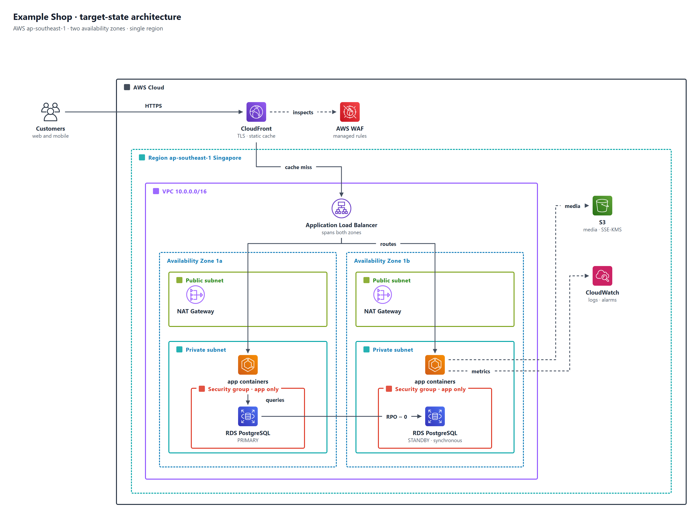

# aws-architecture-diagram

A [Claude Code](https://claude.com/claude-code) skill that draws clean, print-ready AWS
architecture diagrams from a small Python data file. It renders the official AWS icons and
the AWS group palette (cloud, region, availability zones, subnets, security groups) with
Chrome, then audits the result so that no connector crosses text or an icon, no label sits
on a border, no endpoint floats, and no two connectors cross.



The diagram is data, not a drawing. You edit coordinates in a data file, build, and run the
checker. You look at the picture only when the checker reports zero findings. Eyeballing a
3,700 px image misses things; the checker does not.

## What is in the skill

| Path | What |
|---|---|
| `SKILL.md` | the workflow Claude follows: agree content, lay out groups, place icons, route connectors in lanes, build, check, then look |
| `references/conventions.md` | the AWS palette, the spacing rules the checker enforces, layout patterns, and the lessons behind each rule |
| `scripts/fetch_icons.py` | copies icons out of the `diagrams` package under short names (`eks`, `rds`, `alb`, `argo`, `gitlab`, ...) |
| `scripts/build_diagram.py` | data file to PNG: HTML, Chrome headless at 2x, cropped |
| `scripts/check_diagram.py` | the geometry audit, measuring labels with the real font |
| `scripts/export_drawio.py` | the same diagram as a native `.drawio` with live AWS4 shapes |
| `scripts/export_eraser.py` | Eraser diagram-as-code, ready for app.eraser.io or the Eraser MCP |
| `scripts/export_figma.py` | two Figma Plugin API scripts for the Figma MCP's `use_figma` |
| `scripts/export_mermaid.py` | a Mermaid `architecture-beta` block for READMEs |
| `assets/template_diagram.py` | a two-zone starter that builds at zero findings |

## Install

Copy the folder into your personal skills directory:

```
git clone https://github.com/akzedevops/aws-architecture-diagram-skill ~/.claude/skills/aws-architecture-diagram
```

Claude Code loads every skill under `~/.claude/skills/`. Then, in any session, type
`/aws-architecture-diagram` or simply ask for an AWS architecture, VPC or deployment
diagram.

Requirements on the machine that renders: Python 3.9+, `pip install diagrams pillow`
(the `diagrams` package bundles the AWS Architecture Icons), and Chrome, Chromium or Edge.
Set `CHROME=/path/to/browser` if it is not in a standard location.

## Quick start without Claude

```
cp assets/template_diagram.py diagram.py
python scripts/fetch_icons.py --dir icons-aws users cloudfront waf alb ecs rds s3 cloudwatch nat
python scripts/build_diagram.py diagram.py
python scripts/check_diagram.py diagram.py
```

`check_diagram.py --calibrate` prints the label widths it measured, useful if your machine
has different fonts. `fetch_icons.py --list kube` searches the whole icon tree.

## Exports

One data file, four more outputs, all regenerated rather than hand-edited:

```
python scripts/export_drawio.py diagram.py    # architecture.drawio, editable AWS4 shapes
python scripts/export_eraser.py diagram.py    # architecture.eraser, paste into app.eraser.io
python scripts/export_figma.py diagram.py     # _figma/figma_step1.js for the Figma MCP
python scripts/export_mermaid.py diagram.py   # architecture.mmd for READMEs
```

The draw.io file keeps the PNG's groups, routes and labels, so it opens looking like the
render. Eraser and Mermaid lay out on their own, so those copies keep the structure and
the flows but not the lanes. The Figma export is two Plugin API scripts run through the
Figma MCP's `use_figma` (step 1 creates zones, icon placeholders and captions and returns
the frame id; step 2, generated with `--root <id>`, adds connectors and labels), followed
by `upload_assets` for the icon PNGs.

## How it compares

AWS's own `awsdac` and Eraser lay out for you from YAML or a DSL; the `diagrams` package
and Graphviz do the same from Python. They are faster for a first sketch and weaker on
the last mile: crossings, lanes, label placement and print quality. draw.io skills give
editable files but no audit. This skill takes the opposite bet: you control every
position, and the checker proves the result is clean before you look at it.

## Data file

```python
TITLE, SUBTITLE = "Shop  ·  target-state architecture", "line one<br>line two"
W, H = 1500, 1030                 # canvas in CSS px; the PNG is rendered at 2x
ICON_DIR, OUT = "icons-aws", "architecture.png"
STRADDLE = {"sga"}                # groups whose label sits on the top border
ACCEPTED_CROSSINGS = set()        # {("label a", "label b")} crossings kept on purpose
GROUPS = [(key, x, y, w, h, label, border_colour, label_colour, dashed, chip), ...]
RES    = [(icon_name_or_None, centre_x, top_y, label, sublabel), ...]
CONN   = [(points, dashed, label, (label_x, label_y)), ...]   # 5th item 0 = no arrowhead
```

## What the checker reports

```
label-on-border      a chip covers a group border
label-on-text        a chip overlaps a caption or another chip
label-on-icon        a chip touches an icon
label-hides-line     a chip sits over a line that is not its own
line-through-text    a segment crosses a caption or a group label
line-through-icon    a segment passes through an icon it does not start or end at
floating-end         an endpoint is near no icon, caption or other line
lines-too-close      two parallel runs under 14 px apart
line-on-border       a run lies within 6 px of a border it is parallel to
lines-cross          two connectors cross
grouplabel-on-icon   a group label overlaps an icon
```

The exit code is the number of findings, so it can gate a build.

## Credits

Icons are the AWS Architecture Icons and other sets bundled with
[mingrammer/diagrams](https://github.com/mingrammer/diagrams); AWS's icon terms apply to
their use. Everything else is MIT licensed.
